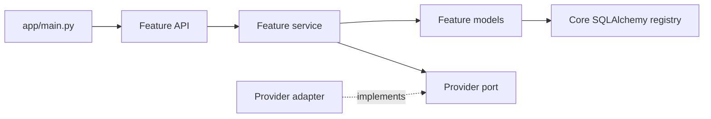

# Feature-based FastAPI architecture

This document describes the implemented package layout and how to extend it.
The HTTP contract remains stable while Python modules are organized by feature.

## Package map

```text
app/
  main.py                         # FastAPI app, health, errors, router composition
  core/
    auth.py, dependencies.py      # Auth mode and verified current-host dependency
    database.py, model.py         # Engine/session and shared SQLAlchemy registry
    errors.py, http.py            # Domain errors, service wiring, safe projection
    timezones.py                  # IANA timezone validation
  features/
    hosts/                        # Host registration and identity record
    profiles/                     # Public profile and host settings
    availability/                 # Schedule, intervals, pure slot generator
    event_types/                  # Event drafts and publication
    bookings/                     # Public booking, host meetings, lifecycle
    calendars/                    # Connection settings, lifecycle, Composio adapter
    contacts/                     # Contact queries and notes
    onboarding/                   # Setup and guide state
    workflows/                    # Stored workflow definitions and listing
    notifications/                # Email outbox, retry, webhook, Resend adapter
  workos_auth.py                  # WorkOS AuthKit session flow
  auth.py, models.py, schemas.py,
  service.py, ...                 # Compatibility exports for old flat imports
tests/                             # HTTP, domain, auth, provider, concurrency tests
```

Within a feature, `api.py` and `workspace_api.py` own routes; `schemas.py` and
`workspace_schemas.py` own Pydantic contracts; `models.py` owns tables; and
`service.py` or `operations.py` owns decisions. The composed
`bookings/service.py::SchedulerService` keeps one booking transaction boundary
while feature mixins own individual operations. `availability/slots.py` is a
pure calculation. `calendars/ports.py` and `notifications/ports.py` define
provider methods; their `providers/` directories contain optional SDK
implementations. Add a file only when the feature needs it.

## Dependency direction



Routes obtain the current host from `app/core/dependencies.py` and pass its ID
to services. A feature may read another feature's model for a business rule,
but should not import another feature's HTTP routes. Booking creation owns
cross-feature reservation rules. Provider modules do not own transactions.
The flat `app/*.py` exports exist for compatibility; new code imports its owner
module directly.

## Add or change a feature

1. Put the table in that feature's `models.py` and use
   `app.core.model.Base`. Register a new model module in
   `app/core/database.py::create_schema`; add a migration before deploying a
   schema change to an existing database.
2. Add request and response models to the feature's schemas. Keep validation
   and domain errors explicit. Never serialize API key hashes, action token
   hashes, provider secrets, or WorkOS IDs into public responses.
3. Put decisions and host-scoped queries in the feature service. Derive host
   ownership from `get_current_host` at the route boundary. Public routes
   resolve only active, public event types or verify action tokens.
4. Add an `APIRouter` in the feature package and include it in `app/main.py`.
   Preserve an existing path and status when reorganizing code.
5. Add a focused HTTP or service test. Run `python -m pytest -q` and
   `ruff check app`. For a refactor, compare generated OpenAPI JSON before
   and after.

For a new calendar or email provider, implement the relevant port and inject
it at the route/service boundary. Test success, safe failure, and recovery
without live credentials. Preserve the rules for ambiguous calendar creates
and stable email idempotency keys.

## Booking and security invariants

- Booking instants are UTC. Weekly and date-specific availability use local
  wall-clock minutes in an IANA timezone; date overrides replace weekly rules.
- Recheck the slot while holding the host reservation lock. Preserve the
  cross-event overlap and scheduled event/start uniqueness protections.
- Commit the local booking and durable notification intent before external
  calls. An external failure must not silently remove a valid reservation.
- Keep cancel and reschedule tokens distinct, hashed at rest, and rotated on
  reschedule. Never log raw action tokens or stored hashes.
- Scope protected reads and writes to the verified host, including contacts,
  calendar settings, delivery retries, and reconciliation.
- Preserve each booking's calendar destination ID. Do not automatically retry
  an ambiguous calendar create until its outcome has been reconciled.

## Compatibility and current limits

The old flat import paths are re-exports for existing clients and tests. They
are intentionally thin and should not acquire new business logic. WorkOS
session handling remains in `app/workos_auth.py` because auth is shared by all
features. The starter uses `create_all` for first-run setup; production schema
changes need Alembic migrations. Real WorkOS, Composio, and Resend tenants
still need provider-backed verification before deployment.
