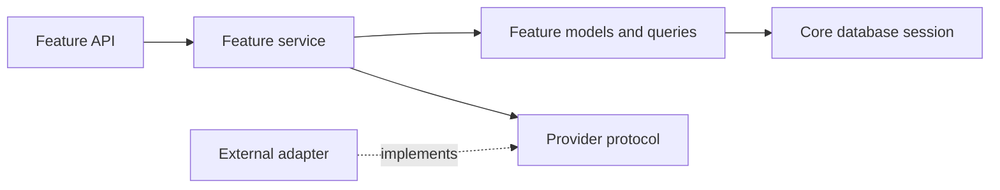

# Feature based architecture

This is the proposed module layout for the standalone FastAPI scheduler. It describes how to evolve the current compact implementation without changing its HTTP contract in one large rewrite. The existing files have **not** been moved by this document.

## Target layout

```text
app/
  main.py                         # Create app, install exception handlers, include routers
  core/
    config.py                     # Validated environment settings
    database.py                   # Engine, sessions, transaction helpers
    errors.py                     # Domain errors and HTTP translation
    auth.py                       # Verified identity and current-host dependency
  features/
    hosts/
      api.py                      # Host registration and own-host endpoints
      models.py                   # Host record and identity mapping
      schemas.py
      service.py
    profiles/
      api.py                      # Profile settings
      models.py                   # Optional host preferences
      schemas.py
      service.py
    availability/
      api.py                      # Default schedule management
      models.py                   # Schedule and intervals
      schemas.py
      slots.py                    # Pure timezone-aware slot generation
      service.py
    event_types/
      api.py                      # Host CRUD and publication
      models.py                   # Event type and invitee fields
      schemas.py
      service.py
    bookings/
      public_api.py               # Public profile/event/slots/book/actions
      host_api.py                 # Host meeting list, export, cancel, retry
      models.py                   # Booking and answers
      schemas.py
      service.py                  # Reservation and lifecycle transaction boundary
      tokens.py                   # Action-token creation and verification
    calendars/
      api.py                      # Connect, sync, preferences
      models.py                   # Connection and external calendars
      service.py
      ports.py                    # Calendar provider protocol
      providers/composio.py       # Optional Composio implementation
    contacts/
      api.py
      models.py
      service.py
    onboarding/
      api.py
      models.py
      service.py
    workflows/
      api.py
      models.py
      service.py
    notifications/
      api.py                      # Webhook and delivery administration
      models.py                   # Outbox, attempts, webhook deduplication
      service.py
      ports.py                    # Email provider protocol
      providers/resend.py         # Optional Resend implementation
  infrastructure/
    migrations/                   # Alembic migrations once introduced
tests/
  features/                       # HTTP and service tests grouped by feature
  integration/                    # Cross-feature booking and database tests
```

Each feature owns its routes, schemas, persistence model, and business rules. Add a file only when that feature needs it; a pure calculation such as `availability/slots.py` does not need a repository class. `main.py` should remain small and only compose routers and dependencies.

## Dependency direction



Feature APIs can call their own services. Cross-feature rules belong in the use case that owns the outcome: booking creation belongs in `bookings/service.py`, which reads event type and availability data and asks calendar and notification ports for external effects. Calendar and notification modules should never import booking HTTP routes. Keep provider SDK imports inside adapters so local booking and tests run without provider credentials.

## Booking transaction

1. Resolve a published event and generate candidate slots in its schedule timezone.
2. Read local and connected-calendar busy intervals, then reject an unavailable requested slot.
3. Acquire the host reservation lock and repeat the slot check inside the transaction.
4. Save the booking, answers, and any durable outbox records together; commit once.
5. Perform external calendar/email work after the local commit. Persist sync and delivery results, and retry failures with stable idempotency keys.

The API must derive host ownership from a verified identity, never a supplied host ID. Public action tokens are distinct by action, stored only as hashes, and rotated when appropriate. Booking instants stay in UTC; schedule rules stay in an IANA timezone.

## Auth boundary

The identity module maps a verified WorkOS user or a local development credential to exactly one host record. Routes depend on `current_host`; feature services receive that host ID explicitly. A WorkOS session implementation should own login, callback, refresh, and logout. Business features should not parse cookies or bearer tokens.

## Migration from the current files

Move one feature at a time and keep the same path, method, request schema, response schema, and error status while doing so. A practical order is:

1. Extract `core/database.py`, `core/errors.py`, and identity dependencies. Keep `app/main.py` as a compatibility facade.
2. Move the pure availability function and its tests.
3. Move event types and booking service methods, preserving the reservation concurrency test.
4. Move calendar and notification adapters behind protocols.
5. Move profile, meetings, contacts, onboarding, and workflow endpoints.
6. Replace automatic table creation with Alembic migrations and check the generated OpenAPI diff.

At each step, run the existing HTTP tests plus the affected feature tests. Do not change the URL layout merely because the Python module layout changes. Update the root architecture guide when this target becomes the actual implementation.

## Current-to-target map

| Current module | Intended owner |
| --- | --- |
| `app/auth.py`, `app/dependencies.py` | `core/auth.py` and `features/hosts/` |
| `app/availability.py` | `features/availability/slots.py` |
| `app/service.py` | `features/event_types/service.py` and `features/bookings/service.py` |
| `app/calendar.py`, `app/calendar_routes.py`, `app/integrations/calendar.py` | `features/calendars/` |
| `app/workspace.py`, `app/workspace_routes.py` | Profiles, bookings, contacts, onboarding, and workflows |
| `app/integrations/email.py` | `features/notifications/providers/resend.py` |
| `app/models.py`, `app/schemas.py` | Feature-owned models and schemas |
| `app/storage.py` | `core/database.py` |
